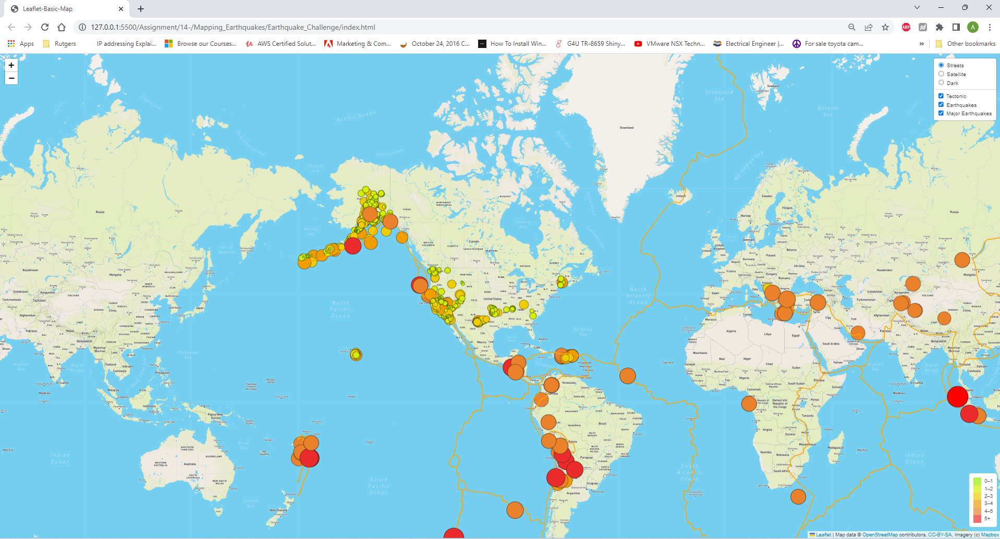

# Mapping_Earthquakes

## 1. OverView of the mapping:
    This map was created to dipected earthquake information on the one scree. Three diffferent layers are added to provide required information by selecting option. Different map sytels are also included like Street view, Satellite view and Dark view. Tectonic plates location as well as Major earthquack location on earth is dipected.

### Map Picture
 
